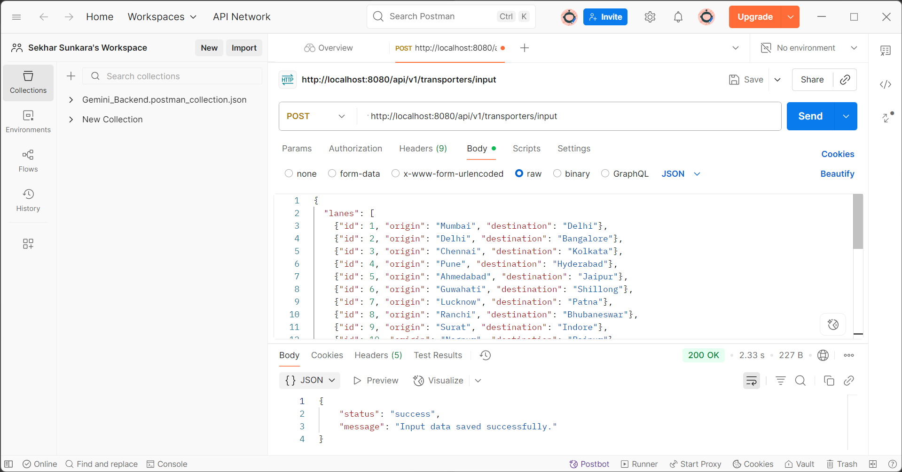
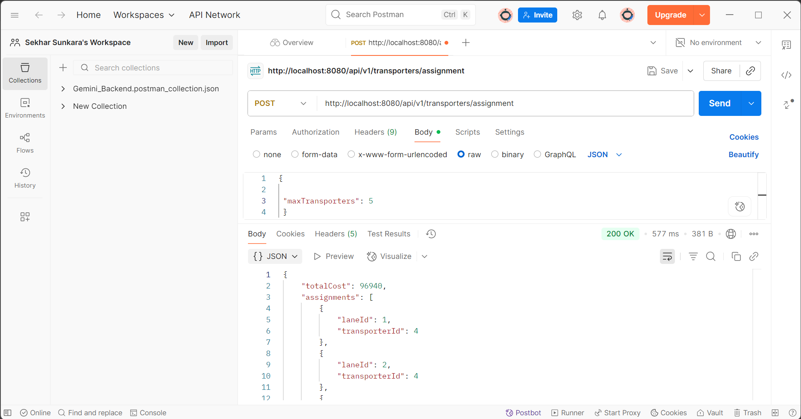

# Transporter Assignment Backend

This Spring Boot application solves the **Transporter Assignment on Lanes** problem in India, optimizing assignments based on cost, transporter usage, and full lane coverage.

---

## Table of Contents

- [Project Overview](#project-overview)
- [Features](#features)
- [Technologies](#technologies)
- [API Endpoints](#api-endpoints)
- [Data Models](#data-models)
- [Setup and Running](#setup-and-running)
- [Testing](#testing)
- [Sample Inputs and Expected Outputs](#sample-inputs-and-expected-outputs)
- [API Testing Proof](#api-testing-proof)
- [Design and Code Quality](#design-and-code-quality)
- [Contact](#contact)

---

## Project Overview

The app assigns transporters to lanes across India with the goals to:

- **Minimize total cost** of assignments
- **Maximize transporter usage** up to a user-provided limit
- **Ensure every lane is assigned** at least one transporter

Two REST APIs are provided for data input and fetching assignments.

---

## Features

- REST APIs for submitting lane and transporter quote data and retrieving optimized assignments.
- Heuristic assignment algorithm respecting cost minimization, transporter usage, and lane coverage constraints.
- Modular service and controller layers with DTO pattern.
- Comprehensive manual and unit testing.
- Clean JSON API responses consistent with specifications.

---

## Technologies

- Java 17
- Spring Boot 3.5.5
- Spring MVC, Spring Data JPA
- PostgreSQL (or your chosen database)
- Maven for build automation
- JUnit 5 for unit testing

---

## API Endpoints

### 1. Submit Input Data  
`POST /api/v1/transporters/input`

**Request Body**

```
{
  "lanes": [
    {"id": 1, "origin": "Mumbai", "destination": "Delhi"},
    ...
  ],
  "transporters": [
    {
      "id": 1,
      "name": "Transporter T1",
      "laneQuotes": [{"laneId":1,"quote":5000}, ...]
    },
    ...
  ]
}
```

**Response**

```
{
  "status": "success",
  "message": "Input data saved successfully."
}
```

---

### 2. Get Optimized Assignment  
`POST /api/v1/transporters/assignment`

**Request Body**

```
{
  "maxTransporters": 3
}
```

**Response**

```
{
  "totalCost": 29000,
  "assignments": [
    {"laneId": 1, "transporterId": 1},
    ...
  ],
  "selectedTransporters":[1]
}
```

---

## Data Models (DTOs)

- `InputDataDto` — contains `lanes` and `transporters` lists.
- `LaneDto` — lane details (`id`, `origin`, `destination`).
- `TransporterDto` — transporter details with lane quote mapping.
- `LaneQuoteDto` — quote per lane by transporter.
- `AssignmentRequestDto` — input max transporter limit.
- `AssignmentResponseDto` — optimized assignment results.
- `AssignmentDto` — lane to transporter mapping.

---

## Setup and Running

### Clone the repository

```
git clone https://github.com/SekharSunkara6/Transporter-Assignment.git
cd Transporter-Assignment
```

### Prerequisites

- Java 17 or later
- Maven
- PostgreSQL or configured database

### Build & Run

```
mvn clean install
mvn spring-boot:run
```

Application runs on `http://localhost:8080`.

---

## Testing

### Manual API Testing

Use tools like **Postman** or **curl**:

- Submit input data:  
```
curl -X POST http://localhost:8080/api/v1/transporters/input \
-H "Content-Type: application/json" \
-d @input.json
```

- Get optimized assignment:  
```
curl -X POST http://localhost:8080/api/v1/transporters/assignment \
-H "Content-Type: application/json" \
-d '{"maxTransporters":3}'
```

### Unit Testing

JUnit 5 tests cover Controller and Service layers.

Run tests with:

```
mvn test
```

---

## Sample Inputs and Expected Outputs

Use the sample JSON inputs as provided in the assignment and see corresponding assignment outputs matching task constraints.

---

## API Testing Proof

### 1. Submit Input Data API Test



### 2. Get Optimized Assignment API Test



---

## Design and Code Quality

- Modular service and controller layers.
- DTO pattern separates API and domain models.
- Heuristic ensures all assignment constraints.
- Clear, maintainable Java code with unit tests.

---

## Contact

Email - sekharsunkara2002@gmail.com
Portfolio - https://sekharsunkaraportfolio.netlify.app/

---

*Thank you for reviewing my Transporter Assignment project.
